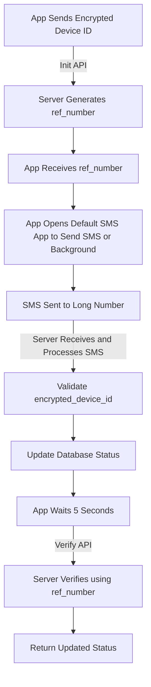

# SIM Binding Flow Documentation

**Prepared By:** [Gowtham Sooryaraj](https://github.com/sooryaraj/) 

## **1. Initialization API**

-   **Endpoint**: `simBinding/init`
-   **Action**:
    -   The app sends the `encrypted_device_id` to the server.
    -   The server stores the data with the status `PENDING` and generates a `ref_number`.

### Request Example:

```json
{
    "encrypted_device_id": "SAAFE STAGE-VERIFY h/ZIpg2redwTXpBP8EOb++hQMK3FizB+dPE0jTfnqfrO+LC+wp0wc0qy2oTW4AOj"
}

```

### Response Example:

```json
{
    "status": "pending",
    "ref_number": "REF123456"
}

```

----------

## **2. Send SMS (Pre-Filled Message)**

-   **Action**:
    -   Use the default SMS app to send the `sms_body` to the `sms_number`.

### SMS Content Example:

```
SAAFE STAGE-VERIFY h/ZIpg2redwTXpBP8EOb++hQMK3FizB+dPE0jTfnqfrO+LC+wp0wc0qy2oTW4AOj

```

### Flutter Implementation:

```dart
void sendSMS(String number, String body) async {
  final uri = Uri(
    scheme: 'sms',
    path: number,
    queryParameters: {"body": body},
  );
  if (await canLaunchUrl(uri)) {
    await launchUrl(uri);
  }
}

```

----------

## **3. Long Number Response (Server-Side Processing)**

-   **Action**:
    -   The server receives the SMS sent to the long number.
    -   The server processes the SMS by:
        -   Extracting the  `encrypted_device_id` from the SMS body.
        -   Matching these values against the database records.
        -   If valid, updating the status of the record to `completed` or `success`.

----------

## **4. Delay and Verify API**

-   **Endpoint**: `simBinding/verify`
-   **Action**:
    -   The app waits **5 seconds** after sending the SMS and then hits the verify API.
    -   The app sends the `ref_number` to verify the binding status.
    -   The server checks if the `encrypted_device_id` and `ref_number` are validated.

### Request Example:

```json
{
    "ref_number": "REF123456"
}

```

### Response Example:

```json
{
    "status": "success",
    "message": "SIM binding verified successfully"
}

```

----------

## **Complete Workflow Overview**

### **1. Initialization:**

-   The app sends the `encrypted_device_id` to the server (`init API`).
-   The server responds with a `ref_number`.

### **2. Send SMS:**

-   The app opens the default SMS app, pre-filled with the `sms_body` and `sms_number`.

### **3. Server Processing:**

-   The server receives the SMS sent to the long number.
-   Validates the  `encrypted_device_id` and updates the database status.

### **4. Delay and Verify:**

-   After a 5-second delay, the app hits the `verify API` with the `ref_number`.
-   The server checks the database and returns the updated status.

----------

## **High-Level Diagram**


