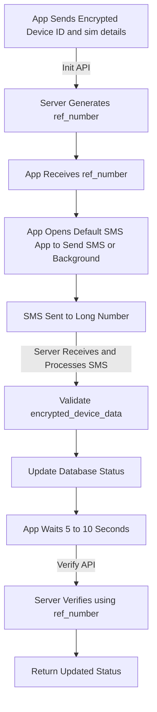

# SIM Binding Flow Documentation

## **1. Initialization API**

-   **Endpoint**: `simBinding/init`
-   **Action**:
    -   The app sends the `encrypted_device_data` to the server.
    -   The server stores the data with the status `PENDING` and generates a `ref_number`.

### Request Example:

```json
{
    "encrypted_device_data": "SAAFE VERIFY h/ZIpg2redwTXpBP8EOb++hQMK3FizB+dPE0jTfnqfrO+LC+wp0wc0qy2oTW4AOj"
}

```

### Response Example:

```json
{
    "status": "pending",
    "ref_number": "REF123456"
}

```

----------

## **2. Send SMS (Pre-Filled Message)**

-   **Action**:
    -   Use the default SMS app to send the `sms_body` to the `sms_number`. (or)
    -   Use SEND_SMS permission to send sms from background.

### Encrypted Hash Example:
```
// Android
uniqueDetails = "${phoneNumber} ${countryCode} ${carrierName} ${deviceID}";
// iOS
uniqueDetails = deviceID; // iOS does'nt provide SIM details we can't use. 
```
### SMS Content Example:

```
SAAFE VERIFY h/ZIpg2redwTXpBP8EOb++hQMK3FizB+dPE0jTfnqfrO+LC+wp0wc0qy2oTW4AOj
```


----------

## **3. Long Number Response (Server-Side Processing)**

-   **Action**:
    -   The server receives the SMS sent to the long number.
    -   The server processes the SMS by:
        -   Extracting the  `encrypted_device_data` from the SMS body.
        -   Matching these values against the database records.
        -   If valid, updating the status of the record to `completed`.

----------

## **4. Delay and Verify API**

-   **Endpoint**: `simBinding/verify`
-   **Action**:
    -   The app waits **5 to 10 seconds** after sending the SMS and then hits the verify API.
    -   The app sends the `ref_number` to verify the binding status.
    -   The server checks if the `encrypted_device_data` and `ref_number` are validated.

### Request Example:

```json
{
    "ref_number": "REF123456"
}

```

### Response Example:

```json
{
    "status": "success",
    "message": "SIM binding verified successfully"
}

```

----------

## **Complete Workflow Overview**

### **1. Initialization:**

-   The app sends the `encrypted_device_data` to the server (`init API`).
-   The server responds with a `ref_number`.

### **2. Send SMS:**

-   The app opens the default SMS app, pre-filled with the `sms_body` and `sms_number`. or use SEND_SMS permission to send sms in background (android only)

### **3. Server Processing:**

-   The server receives the SMS sent to the long number through web hook.
-   Validates the  `encrypted_device_data` and updates the database status.

### **4. Delay and Verify:**

-   After a 5 to 10-second delay, the app hits the `verify API` with the `ref_number`.
-   The server checks the database and returns the updated status.

----------

## **High-Level Diagram**




### **SIM Detection**

#### **Android**
You need to implement and check the following functions:
- `hasActiveSim`: Checks if a SIM card is active.
- `isAirplaneModeEnabled`: Checks if the device is in airplane mode.

#### **iOS**
You cannot directly check whether a SIM is available on iOS. Instead, you can use the following function to determine if the device is in airplane mode:

```swift
func isAirplaneModeEnabled() -> Bool? {  
    let networkInfo = CTTelephonyNetworkInfo()  
    guard let radioAccessTechnology = networkInfo.serviceCurrentRadioAccessTechnology else {  
        return nil  
    }  
    return radioAccessTechnology.isEmpty  
}
```
#### **SEND_SMS Permission**

In the Play Console, select **Device Automation** as the core functionality when requesting SMS and Call Log permissions.

>In **Google Play Console**, select your app and navigate to ```Monitor and Improvement → Policy and Programs → App Content```. Locate SMS and Call Log permissions and click **Manage**. This will redirect you to the SMS and Call Log permissions page, where you need to select **Device Automation**.

**Description**
>We have implemented SIM binding in our application to provide an additional layer of security. As part of the Android implementation, the app sends a verification SMS to a long number provider in the background, which requires the use of the SEND_SMS permission.


**Note**
The application was still rejected even after selecting Device Automation. First, remove the SEND_SMS permission (used for the SIM Binding feature) and upload the build to the Play Store for approval. Once approved, resubmit the application with the SEND_SMS permission.

### **Credits and Acknowledgements**

This documentation is not only prepared but also conceptualized by Gowtham Sooryaraj. The ideology and implementation strategy for SIM binding were meticulously designed to address modern security and usability challenges.

-   **[Saafe.in](https://app.saafe.in/):** For their support in realizing this concept.
    
-   **Ideation and Preparation:**  [Gowtham Sooryaraj](https://github.com/sooryaraj)


